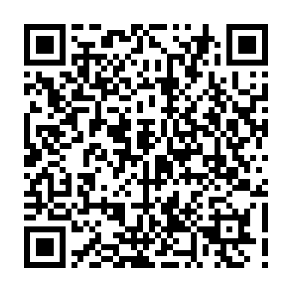

# فاحص الفواتير الضريبية السعودية

أداة محلية تفحص الفواتير الضريبية السعودية وتستخرج بياناتها إلى إكسل تلقائياً.

تقرأ **باركود الزاتكا (QR)** لاستخراج بيانات المورد والمبالغ بدقة كاملة، وتتحقق من اكتمال الفاتورة وصحة أرقامها، وتنبّه على الناقص والمكرّر والمتناقض.

**تشتغل على جهازك بالكامل** — ما يُرفع أي ملف للإنترنت.

---

## ليش الباركود؟

الفاتورة السعودية فيها باركود مربّع تُلزم به هيئة الزكاة والضريبة والجمارك، وهو **ليس صورة** — هو نص `Base64` مشفّر بصيغة TLV يحمل بيانات الفاتورة:



| الوسم | المحتوى |
|:--:|---|
| 1 | اسم البائع |
| 2 | الرقم الضريبي للبائع |
| 3 | التاريخ والوقت |
| 4 | الإجمالي شامل الضريبة |
| 5 | مبلغ الضريبة |

<br clear="left">

الباركود على اليمين يحمل فعلياً:

```
اسم البائع            : مكتبة جرير
الرقم الضريبي للبائع  : 300000000000003
التاريخ والوقت        : 2026-08-12T13:45:00Z
الإجمالي شامل الضريبة : 1150.00
مبلغ الضريبة          : 150.00
المبلغ قبل الضريبة    : 1000.00   ← محسوب
```

يعني البرنامج **ما يقرأ الحبر** — يفكّ تشفير بيانات. فما فيه خطأ قراءة إطلاقاً، حتى لو الصورة مايلة أو مشوّشة أو الخط باهت. إما تُفكّ صحيحة ١٠٠٪، أو ما فيه باركود أصلاً.

وهذي خمسة من الأعمدة الستة المطلوبة في الإكسل — مجاناً وبدون قراءة ضوئية.

---

## طبقات القراءة

يستخدم البرنامج أربع طبقات بالترتيب، كل واحدة تكمّل اللي قبلها:

| # | الطبقة | الدقة | يستخرج |
|:--:|---|---|---|
| 1 | **باركود الزاتكا** | ١٠٠٪ | اسم المورد، رقمه الضريبي، التاريخ، الضريبة، الإجمالي |
| 2 | **نص PDF المضمّن** | ١٠٠٪ | كل ما هو مكتوب في ملف PDF أصلي |
| 3 | **محرك قراءة ويندوز** | متوسطة | الأرقام بثقة، والأسماء العربية بتشويه |
| 4 | **تعبئة يدوية** | ١٠٠٪ | ما تبقّى — من الواجهة مباشرة |

**الباركود هو المرجع دائماً.** إذا خالفته قراءة أخرى، يثبّت البرنامج قيمة الباركود ويطلع تنبيهاً بالاختلاف بدل ما يكتب فوقها — وهذي من أهم فحوصاته.

---

## التنصيب

يحتاج [Python 3.10+](https://python.org) على ويندوز.

```bash
git clone https://github.com/SA-94/saudi-invoice-checker.git
cd saudi-invoice-checker
pip install -r requirements.txt
```

أو دبل كليك على **`INSTALL.bat`** بعد التحميل.

---

## الاستخدام

### الواجهة (الأسهل)

دبل كليك على **`START-WEB.bat`** — المتصفح يفتح على `http://localhost:5000`.

اسحب الفواتير على الصفحة، والنتيجة تطلع فوراً في جدول ملوّن. تقدر:

- تضغط على أي فاتورة تشوف صورتها والتنبيهات
- تعبّي الحقول الناقصة بيدك ويُعاد الفحص فوراً
- تكتب المبالغ المطبوعة عشان تُقارن بالباركود
- تنزّل الإكسل بزر

فيه زر **«جرّبه على فواتير تجريبية»** يفحص خمس أمثلة جاهزة قبل ما تحط فواتيرك.

### بدون متصفح

```bash
python check.py                  # يفحص مجلد «الفواتير»
python check.py "D:\مسار\ثاني"   # يفحص مجلداً آخر
```

أو دبل كليك على **`CHECK-INVOICES.bat`**.

الصيغ المدعومة: `JPG` `PNG` `HEIC` `WEBP` `TIFF` `BMP` `PDF`

---

## المُخرَجات

ملف إكسل بثلاث أوراق:

**«البيانات»** — ستة أعمدة، وصف مجموع في الآخر:

| تاريخ الفاتورة | اسم المورد | الرقم الضريبي للمورد | المبلغ قبل الضريبة | الضريبة | المبلغ شامل الضريبة |
|---|---|---|---|---|---|

التاريخ والمبالغ تُكتب كقيم حقيقية — تُفرز وتُجمع في إكسل مباشرة.

**«الفحص التفصيلي»** — اسم الملف والحالة، وكل شرط في عمود بعلامة ✔ أو ✘

**«التنبيهات»** — الفواتير اللي فيها مشكلة فقط، وكل تنبيه في سطر

الأوراق الثلاث مرتّبة بنفس الترتيب، فيسهل مطابقة أي صف.

---

## الفحوصات

### الحالات

| الحالة | معناها |
|---|---|
| **سليمة** | كل الشروط موجودة والأرقام متطابقة |
| **تحتاج مراجعة** | البيانات موجودة لكن فيها شي غريب |
| **ناقصة** | فيه شرط إلزامي غير موجود |

### إلزامي

الباركود · تاريخ الفاتورة · اسم المورد ورقمه الضريبي · اسم الجمعية ورقمها الضريبي · المبلغ قبل الضريبة · الضريبة · المبلغ شامل الضريبة · رقم الفاتورة · اسم الفاتورة

### اختياري

عنوان المورد · عنوان الجمعية

### فحوصات الصحة

- الرقم الضريبي ١٥ رقماً، يبدأ بـ`3` وينتهي بـ`3`
- المبلغ قبل الضريبة + الضريبة = المبلغ شامل الضريبة
- نسبة الضريبة ١٥٪ (أو ٥٪ أو صفر للمعفاة)
- المبالغ المطبوعة تطابق المشفّرة في الباركود
- ما فيه فاتورة مكرّرة
- الرقم الضريبي للمورد ≠ الرقم الضريبي للجمعية

---

## ملاحظات تقنية

**حدود قراءة الباركود** — مقيسة على فواتير مولّدة تحاكي التصوير بالجوال (ميلان + تشويش + ضوضاء):

| مقاس الباركود | نظيف | خفيف | متوسط | شديد |
|---|:--:|:--:|:--:|:--:|
| ١١٠ بكسل | ✔ | ✔ | ✔ | ✘ |
| ١٢٥ بكسل | ✔ | ✔ | ✔ | ✔\* |
| ١٥٠ بكسل فأكثر | ✔ | ✔ | ✔ | ✔ |

\* بعد سلسلة المعالجة المتدرّجة (قصّ منطقة الباركود، إزالة ضوضاء، زيادة حدّة، عتبة أوتسو).

القراءة على مراحل: الفواتير السهلة تُقرأ في **٠٫٠١ ثانية**، والصعبة تصعد للمعالجة المكلفة وتُقرأ في أقل من ثانية.

**القراءة الضوئية** تستخدم محرك ويندوز المدمج (`Windows.Media.Ocr`) — مجاني وبدون إنترنت. التكبير هو أهم عامل في دقته: على فاتورة حقيقية بمقاس 785×1280 التقط ٣ حقول من ٥ بالمقاس الأصلي، و**٥ من ٥** بعد التكبير للضلع الأطول ≈ ٣٦٠٠ بكسل.

**الأرقام الضريبية** تُستخرج ملاصقة لتسميتها فقط (`الرقم الضريبي`، `TRN`، `VAT No`…). البحث الحر عن أي ١٥ رقماً يبدأ بـ`3` وينتهي بـ`3` يلتقط أرقام طلبات وسجلات تجارية بالخطأ — ورقم خاطئ يبدو صحيحاً أسوأ من خانة فارغة.

---

## البنية

```
invoice_checker/
  zatca_qr.py     فكّ باركود الزاتكا (TLV) + سلسلة معالجة الصور
  loader.py       تحميل الصور و PDF (يشمل HEIC)
  win_ocr.py      القراءة الضوئية عبر محرك ويندوز
  text_hints.py   استخراج الحقول من النص
  validate.py     قواعد الفحص وتحديد الحالة
  excel_out.py    كتابة الإكسل
  pipeline.py     تجميع الطبقات
web_app.py        خادم الواجهة (Flask)
templates/        صفحة الواجهة
check.py          التشغيل من سطر الأوامر
```

---

## الرخصة

[MIT](LICENSE)
